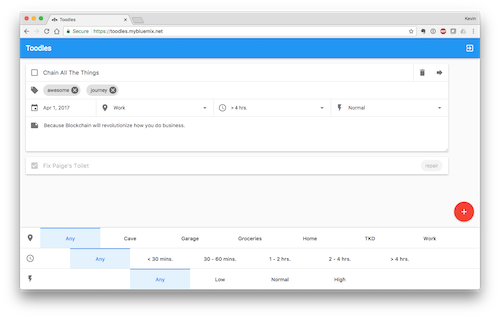

# IBM

I started at IBM in July 2015 as a Developer Advocate focused on Mobile Foundation - a set of native SDKs for iOS/Android focused mostly on security and integration with cloud resources. When a product team wanted to release a mobile feature, it was required that they use Mobile Foundation. This sent a lot of varied work my way in the form of reviewing code and UI/UX patterns. This work in turn often supplied me with a steady stream varied content ideas to share with the community.

## Developer Advocacy

In 2016, the existing developer relations organization was being rebooted. New people (read: not IBM employees) were brought in to help guide this effort. One of these people was previously the CEO of Kaazing - where I had worked as Principal Evangelist prior to IBM. I reached out to him, we made the organizational transfer happen, and before I knew it, I was being tasked to write the mission statement for this bold new direction.

Machine Learning was starting to be available to developers at the time, and many were looking to learn about integration ML features into their applications. IBM was known for [Watson v. Jeopardy]([https://www.youtube.com/watch?v=P18EdAKuC1U](https://www.youtube.com/watch?v=P18EdAKuC1U)), but how did you put that kind of smarts into your own projects? Having a Web Standards background from my time at Adobe, I set out to help Web Developers understand and leverage Machine Learning features.

After that work came, blockchain. After that, serverless with Apache OpenWhisk. Always - for me - with a focus on integrating with standards, and making Web Developers into heroes for whatever it was that they were trying to achieve (with or without IBM product). 

## Leadership

Throughout this time IBM had a city-based approach to structuring its advocacy teams. A specific city would be chosen based on a variety of criteria, and a team of local Developer Advocates would be hired in that city. In 2018, I was asked to build an advocacy team in London. I packed up the family, and we spent a summer in the UK. By 2019, that team was a recognized leader across the broader IBM Developer Advocacy organization.

Also in 2019, I moved from managing a team of Developer Advocates, to managing a small team of developers reporting to the [IBM Developer]([https://developer.ibm.com/](https://developer.ibm.com/)) website organization. At first we were focused on performing data analysis on the "paper trails" (blog, Stack Overflow, YouTube, Twitter, etc.) of Developer Advocates employed by our competition. We eventually pivoted to provided an open source community management tooling based on the [Orbit Model]([https://github.com/orbit-love/orbit-model](https://github.com/orbit-love/orbit-model)), which aligns roughly with the Developer Relations practices I have developed over the years.

> Most of the code in this repository will not run any longer - the core products have pivoted, or are simply no longer offered. I keep it around for inspiration, and to occasionally reference patterns of problems I have solved in the past.

## FashionX

When IBM acquired The Weather Company in 2016, there was an internal push to add weather features to every product possible. FashionX explores making fashion/clothing recommendations based on the current and forecast weather. In this proof-of-concept, inline advertisements added a path to monetization.

## Shack Caddy

I do not golf, but I have a lot of friends that do. Weather means everything to a golfer. This native mobile application allowed you to select your favorite golf courses, and get the weather conditions for your specified tee-time. The images used in the application reflected the weather conditions. There was even a fun easter egg interaction that allowed you to practice your [digital] swing.

## Watson Workshop

What are the different things you might do with Watson and Machine Learning in general? How would you leverage these functionalities from the browser? These were the questions this half-day workshop set out to answer. Coverage includes:

- Speech to Text
- Text to Speech
- Conversational interactions
- Visual Recognition
- Language Translation
- Natural Language Processing
- Tone Analysis

## Vision Workshop

How is it that computers actually see? What are the techniques that can be leveraged, and to what ends? This full-day workshop pushes the browser APIs to the very edge of their abilities. You will be surprised just how much you can achieve in an "evergreen" world. Coverage includes:

- Face Detection
- Facial Feature Analysis
- Optical Character Recognition
- Object Detection
- Barcodes (QR and 2D)
- Augmented Reality
- Machine Learning

## Toodles: A Blockchain To-Do List

The to-do list is the new "hello world" for many application frameworks and their related technologies. Is blockchain the right solution for a to-do list? Maybe. Maybe not. Either way, this feature-complete example was among the most viewed repositories on IBM Developer for nearly a year. Some came for the UI (which I designed and implemented). Some came for the CRUD (Go). It was also the backdrop against which I gave several workshops and presentations at conferences around the world.

## Serverless Cloud Storage

Where do you put put files uploaded to a serverless infrastructure? Not on the server - it will be gone when the function stops executing. How does one even upload a file to a serverless function in the first place? Or change headers to designate a file download? This feature complete web application was designed to explore file management on top of a serverless infrastructure using cloud storage options. 

